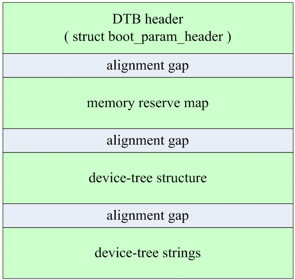

# 设备树

> **设备树是一种描述硬件资源的数据结构**。它通过bootloader将硬件资源传给内核，使得内核和硬件资源描述相对独立。
>
> 设备树的**主要优势**：对于同一SOC的不同主板，只需更换设备树文件.dtb即可实现不同主板的无差异支持，而无需更换内核文件。

## 组成

- `DTS（Device Tree Source）`：dts文件是对Device Tree的描述，放置在内核的/arch/arm/boot/dts目录。一个dts文件对应一个ARM的machine。dts文件描述了一个板子的硬件资源。
- `DTC（Device Tree Compiler）`：编译工具，可以将dts文件编译成dtb文件。
- `DTB（Device Tree Blob）`：DTC将dts编译成dtb文件，bootloader在引导内核是，会预先读取dtb文件到内存进而由内核解析。
- `DTSI（Device Tree Source Include）`：dts文件的头文件。由于一个SOC可能有多个不同的电路板，而每个电路板拥有一个 .dts。这些dts可能会存在许多共同部分，为了减少代码的冗余，设备树将这些共同部分提炼保存在.dtsi文件中，供不同的dts共同使用。

## 结构

> / o device-tree
>       |- name = "device-tree"
>       |- model = "MyBoardName"
>       |- compatible = "MyBoardFamilyName"
>       |- #address-cells = <2>
>       |- #size-cells = <2>
>       |- linux,phandle = <0>
>       |
>       o cpus
>       | | - name = "cpus"
>       | | - linux,phandle = <1>
>       | | - #address-cells = <1>
>       | | - #size-cells = <0>
>       | |
>       | o PowerPC,970@0
>       |   |- name = "PowerPC,970"
>       |   |- device_type = "cpu"
>       |   |- reg = <0>
>       |   |- clock-frequency = <0x5f5e1000>
>       |   |- 64-bit
>       |   |- linux,phandle = <2>
>       |
>       o memory@0
>       | |- name = "memory"
>       | |- device_type = "memory"
>       | |- reg = <0x00000000 0x00000000 0x00000000 0x20000000>
>       | |- linux,phandle = <3>
>       |
>       o chosen
>         |- name = "chosen"
>         |- bootargs = "root=/dev/sda2"
>         |- linux,phandle = <4>

- device tree的基本单元是node，node组成了树状结构。

- 除了root node，每个node都只有一个parent，一个device tree文件中只能有一个root node
- 每个node包含了若干的<property,value>来描述node
- 每个node使用node name来标识：node-name[@unit-address]（需要reg属性）
- 引用node需要使用full path

### property

1. property的value可能为空
2. 可能是一个u32、u64的数值，用<>表示例如cell在Device Tree中表示32bit的信息单位
3. 可以是string或string list
4. 可以是binary data，用[]表示

## DTS

### node结构

```c
[label:] node-name[@unit-address] {
   [properties definitions]
   [child nodes]
}
```

- `label`为引用，node寻址为full path，在多层嵌套是引用不便，可以用label直接引用
- `@unit-address`通常用于区分同一级别（不同级别设备节点名称可以相同，通过地址区分）名字相同的外设备（例如两块内存）
- `child node`可嵌套

### 设备节点结构体

```c
struct device_node {
    const char *name; //设备name
    const char *type; //设备类型
    phandle phandle;
    const char *full_name; //设备全称，包括父设备名
    struct property *properties; //设备属性链表
    struct property *deadprops; //removed properties
    struct device_node *parent; //指向父节点
    struct device_node *child; //指向子节点
    struct device_node *sibling; //指向兄弟节点
    struct device_node *next; //相同设备类型的下一个节点
    struct device_node *allnext; //next in list of all nodes
    struct proc_dir_entry *pde; //该节点对应的proc
    struct kref kref;
    unsigned long _flags;
    void *data;
#if defined(CONFIG_SPARC)
    const char *path_component_name;
    unsigned int unique_id;
    struct of_irq_controller *irq_trans;
#endif
};
```


## DTS示例

```c
/dts-v1/;
#include <dt-bindings/input/input.h>
#include "s5pv210.dtsi"
 
/ {
    model = "YIC System SMDKV210 based on S5PV210";
    compatible = "yic,smdkv210", "samsung,s5pv210";
 
    chosen {
        bootargs = "console=ttySAC2,115200n8 root=/dev/nfs nfsroot=192.168.0.101:/home/run/work/rootfs/rootfs_3.16.57 ip=192.1    68.0.20 init=/linuxrci earlyprintk";
    };  
 
    memory@30000000 {
        device_type = "memory";
        reg = <0x30000000 0x20000000>;
    };  
 
   ethernet@88000000 {
        compatible = "davicom,dm9000";
        reg = <0x88000000 0x2 0x88000004 0x2>;
        interrupt-parent = <&gph1>;
        interrupts = <2 4>;
        local-mac-address = [00 00 de ad be ef];
        davicom,no-eeprom;
        clocks = <&clocks CLK_SROMC>;
        clock-names = "sromc";
    };
    
    key {
        empty_property;
    }
};
```

- `model`：设备制造商的描述，如果两块板子compatible相同就用model区分
- `compatible`：一个由"manufacture，model"字符串组成的string list，系统根据model值查找drivers
- `phandle`：取值必须唯一，在其他dts中可以使用phandle的值来引用该节点

### reg

- `reg`：描述设备在其父总线定义的地址空间中的地址，通常这意味着内存映射IO寄存器块的偏移量和长度
- `#address-cells`：‘#’代表number，表示子节点的reg属性中使用多少个u32来描述地址
- `#size-cells`：表示子节点的reg属性中使用多少个u32来描述地址长度

假设64位系统，如果physical memory分成两段，定义如下：

> RAM: starting address 0x0, length 0x80000000 (2GB)
> RAM: starting address 0x100000000, length 0x100000000 (4GB)

那么父节点#address-cells=<2>，#size-cells<2>，两端物理内存节点描述如下：

```c
//方法1：
memory@0 {
    device_type = "memory";
    reg = <0x000000000 0x00000000 0x00000000 0x80000000
              0x000000001 0x00000000 0x00000001 0x00000000>;
};

//方法2：
memory@0 {
    device_type = "memory";
    reg = <0x000000000 0x00000000 0x00000000 0x80000000>;
};

memory@100000000 {
    device_type = "memory";
    reg = <0x000000001 0x00000000 0x00000001 0x00000000>;
};
```

### 引用

#### phandle引用

```c
pic@10000000 {
    phandle = <1>;
    interrupt-controller;
};
another-device-node {
    interrupt-parent = <1>;   // 使用phandle值为1来引用上述节点
};
```

**使用phandle引用需要确保设备树文件中phandle的值唯一**

#### label引用

```c
PIC: pic@10000000 {
    interrupt-controller;
};
another-device-node {
    interrupt-parent = <&PIC>;   // 使用label来引用上述节点, 
                                 // 使用lable时实际上也是使用phandle来引用, 
                                 // 在编译dts文件为dtb文件时, 编译器dtc会在dtb中插入phandle属性
};
```

dtc在编译的时候会在使用label的节点中增加一个phandle的属性，**增加一个唯一的value**，并把使用它的位置替换为该value。

### 覆盖

#### 1.同一层次的节点，后面的会覆盖前面的节点

```c
    memory@30000000 {
        device_type = "memory";
        reg = <0x30000000 0x20000000>;
    };  
    memory@30000000 {
        reg = <0x30000000 0x10000000>;
    }; 
```

```c
 	memory@30000000 {
        device_type = "memory";
        reg = <0x30000000 0x10000000>;
    };
```

dtc编译之后reg会被覆盖为`reg = <0x30000000 0x10000000>;`

#### 2.直接引用方式覆盖（增加）节点属性

```c
//*.dtsi中的节点
		xusbxti: oscillator@1 {
                compatible = "fixed-clock";
                reg = <1>;
                clock-frequency = <0>;
                clock-output-names = "xusbxti";
                #clock-cells = <0>;
            };  
```

```c
//引用上述dtsi中的节点
&xusbxti {
     clock-frequency = <24000000>;
}
```

在编译过后节点的`clock-frequency`被替换成`<24000000>`

## DTB



### DTB起始段

```c
struct fdt_header {
    uint32_t magic;
    uint32_t totalsize;
    uint32_t off_dt_struct;
    uint32_t off_dt_strings;
    uint32_t off_mem_rsvmap;
    uint32_t version;
    uint32_t last_comp_version;
    uint32_t boot_cpuid_phys;
    uint32_t size_dt_strings;
    uint32_t size_dt_struct;
};
```

- **`magic`：**魔数，此字段应包含值`0xd00dfeed`
- **`totalsize`：**此字段应包含device tree数据结构的总大小（以字节为单位），这个大小包含所有结构的各个部分：标题，内存预留块，结构块和字符串块，以及任何块之间或最终块之后的自由空间间隙
- **`off_dt_struct`：**结构块的偏移量
- **`off_dt_strings`：**字符串块的字节偏移量
- **`off_mem_rsvmap`：**内存预留块的偏移量，**这些保留内存不会进入内存管理系统**
- **`version`：**该dtb的版本
- **`last_comp_version`：**兼容版本信息
- **`boot_cpuid_phys`：**该字段应包含系统引导CPU的物理ID，它应该与device tree中该CPU节点的reg属性中给出的物理ID相同
- **`size_dt_strings`：**此字段应包含device tree blob的字符串块部分的字节长度
- **`size_dt_struct`：**此字段应包含device tree blob的结构块部分的字节长度

### 内存预留段

reserve memory描述符：

```c
struct fdt_reserve_entry {
    uint64_t address;
    uint64_t size;
};
```

### 结构块

描述设备本身的结构和内容，由一系列令牌组成，这些令牌被组织成线性树结构。

#### 令牌

- `FDT_BEGIN_NODE(0x00000001)`：标记节点的开始，后接节点的单元名称，该名称包括以空字符结尾的节点名字符串和单元地址（如果有），如果需要对齐就就填充0x00，然后是下一个令牌，可以是除了`FDT_END`之外的任意令牌

- `FDT_END_NODE(0x00000002)`：标记节点的结束，接`FDT_PROP`以外的任意令牌

- `FDT_PROP(0x00000003)`：节点属性令牌，首先是属性长度，可以为0字节表示空属性；然后是属性名在字符串块中的偏移量；接着属性值占属性长度个字节，如果需要对齐就填充0x00（对齐到32位），然后接除`FDT_END`以外的任意令牌

  ```c
  struct {
      uint32_t len;
      uint32_t nameoff;
  }
  ```

  

- `FDT_NOP(0x00000004)`：覆盖令牌，dtc不解析该令牌，直接跳到下一个令牌解析，因此在此令牌后的所有属性或节点描述都将失效，从树中移除。

- `FDT_END(0x00000009)`：结构块的结束

### 字符串块

包含树中使用的所有属性名称的字符串，这些空终止字符串在本节中简单地连接在一起，并通过字符串块中的偏移量从结构块中引用。**字符串块没有对齐约束，可能出现在device tree blob开头的任何偏移处。**

## DTB示例

```c
/dts-v1/;
/memreserve/ 0x4ff00000 0x100000;
/ {
    model = "YIC System SMDKV210 based on S5PV210";
    compatible = "yic,smdkv210", "samsung,s5pv210";
 
    #address-cells = <1>;
    #size-cells = <1>;
        
    chosen {
        bootargs = "console=ttySAC2,115200n8 root=/dev/nfs nfsroot=192.168.0.101:/home/run/work/rootfs/";
    };  
 
    memory@30000000 {
        device_type = "memory";
        reg = <0x30000000 0x20000000>;
    };  
};
```

编译后的.dtb文件信息如下：


