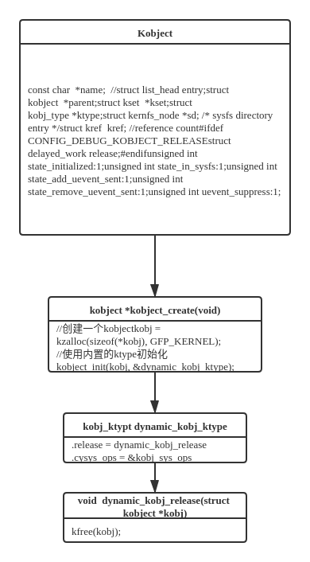
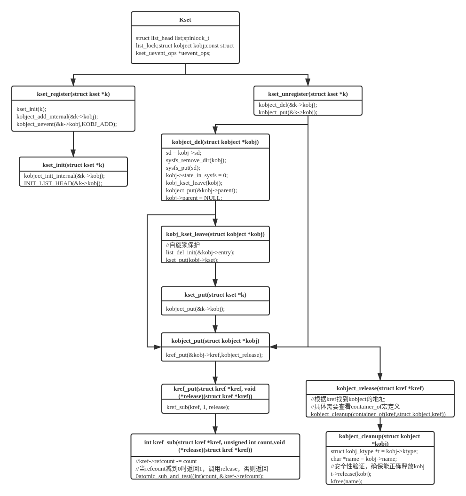

# Kobject


## Foreword

Linux设备模型的核心是使用Bus、Class、Device、Driver四个核心数据结构，将大量的、不同功能的硬件设备抽象并以树状结构进行管理。但是硬件设备繁多，每一个都描述成一个对应的结构体将产生大量的代码冗余，因此Linux参考面向对象程序设计思想，将设备模型数据结构中可能相同的部分单独抽象出来统一实现——Kobject。

- Kobject不会单独出现，通常内嵌在大型数据结构中，为其提供一些底层的功能实现
- 驱动开发者通常很少使用Kobject以及它提供的接口，而是使用构建在Kobject上的设备模型接口

## Kobject & Kset & Ktype


### Kobject

```c
/*
state_initialized，指示该Kobject是否已经初始化，以在Kobject的Init，Put，Add等操作时进行异常校验。
state_in_sysfs，指示该Kobject是否已在sysfs中呈现，以便在自动注销时从sysfs中移除。
state_add_uevent_sent/state_remove_uevent_sent，记录是否已经向用户空间发送ADD uevent，如果有，且没有发送remove uevent，则在自动注销时，补发REMOVE uevent，以便让用户空间正确处理。
uevent_suppress，如果该字段为1，则表示忽略所有上报的uevent事件。
Uevent提供了“用户空间通知”的功能实现，通过该功能，当内核中有Kobject的增加、删除、修改等动作时，会通知用户空间。
*/
struct kobject {
	const char		*name;		//
	struct list_head	entry;
	struct kobject		*parent;
	struct kset		*kset;
	struct kobj_type	*ktype;
	struct kernfs_node	*sd; /* sysfs directory entry */
	struct kref		kref;	//reference count
#ifdef CONFIG_DEBUG_KOBJECT_RELEASE
	struct delayed_work	release;
#endif
	unsigned int state_initialized:1;
	unsigned int state_in_sysfs:1;
	unsigned int state_add_uevent_sent:1;
	unsigned int state_remove_uevent_sent:1;
	unsigned int uevent_suppress:1;
};
```

- `entry`：用于将Kobject加入Kset中的list_head
- `parent`：指向父节点，以此形成层次结构。如果当前kobject没有指定parent，但是又有kset，那么parent将会指向kset，如果两者都没有，那么kobject将作为根节点
- `kset`：kobject所属的kset，可以为NULL。
- `ktype`：kobject的ktype，没有会报错
- `sd`：该kobject在sysfs中的目录入口
- `kref`：kobject的引用计数器

### Kset

```c
struct kset {
	struct list_head list;
    spinlock_t list_lock;
	struct kobject kobj;
	const struct kset_uevent_ops *uevent_ops;
};
```

- `list/list_lock`：用于保存该kset下所有的kobject的链表。
- `kobj`：该kset自己的kobject（kset是一个特殊的kobject，也会在sysfs中以目录的形式体现）。
- `uevent_ops`：该kset的uevent操作函数集。当任何kobject需要上报uevent时，都要调用它所从属的kset uevent_ops，添加环境变量，或者过滤event（kset可以决定哪些event可以上报）。因此，如果一个kobject不属于任何kset时，是不允许发送uevent的。

### Ktype

```c
struct kobj_type {
	void (*release)(struct kobject *kobj);
	const struct sysfs_ops *sysfs_ops;
	struct attribute **default_attrs;
	const struct kobj_ns_type_operations *(*child_ns_type)(struct kobject *kobj);
	const void *(*namespace)(struct kobject *kobj);
};
```

- release：通过该回调函数，可以将包含该种类型kobject的数据结构的内存空间释放掉。
- sysfs_ops：该种类型的Kobject的sysfs文件系统接口。
- default_attrs：该种类型的Kobject的atrribute列表（所谓attribute，就是sysfs文件系统中的文件）。将会在Kobject添加到内核时，一并注册到sysfs中。
- child_ns_type/namespace：和文件系统（sysfs）的命名空间有关，这里不再详细说明。

## Kobject初始化

### kmalloc分配

- 通常随上层数据结构一同分配并在初始化后添加到kernel
- 这种方式分配的kobject，会在引用计数变为0时，由kobject_put调用其ktype的release接口，释放内存空间


### kobject_create(void)分配

- kobject_create内置了一个的默认的ktype（dynamic_kobj_ktype）用于在refcount = 0时释放空间



## Kset的初始化和注册

### kset_init(struct kset *kset)

- 用于初始化**已分配的kset（通常使用kmalloc随上层数据结构一同分配）**，kset->kobject->ktype必须有上层数据结构提供
- kset是一个特殊的kobject，因此kset的初始化会调用kobject的初始化接口



### kset_create_and_add()

- 调用kset_create()动态申请一个kset并register


## Kobject和Kset

### Kset和Kobject的关系


### Kset和Kobject的层次结构

Kset和Kobject通过`list_head`这个链表链接在一起，`list_head`是一个双向链表，同一kset下的kobject被组织成一个双向循环链表，其中kset的`struct list_head list`是链表的表头，kset下的kobject中的`struct list_head entry`是`list`中的一个节点，kset和kobject之间的包含关系实际上是一层层的循环链表的交织，对应**/sys/**目录下的一层层目录或文件[^1][^2]。


```c
   kset(/sys/bus)
                    +--------+
                    | kobj   |
                    |        |
                    +--------+
                    | list   |
       +------------+--------+
       |
       |
       |                      /sys/bus/pci
       v                       +--------+
/sys/bus/term1   /sys/bus/term2|        |
  +--------+     +--------+    |  kobj  |
  |        |     |        +--->+        |
  | kobj   +---->+ kobj   |    +--------+
  |        |     |        |    | list   |
  +--------+     +--------+    +---+----+
                                   |
                                   v
                        /sys/bus/pci/term3
                               +--------+
                               | kobj   |
                               +--------+
```


[^1]: kobject可以通过parent指针（或kset指针）直接找到上层节点（或kset），类比cd指令可以要返回上层目录只需要cd ..

[^2]: 而要从上层访问指定的kobject，必须要有完整的节点地址，类比cd指令要进入制定目录需要使用完整的路径（相对路径需要准确的目录名）