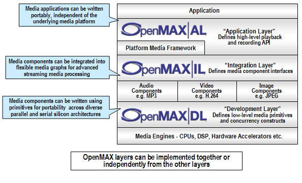
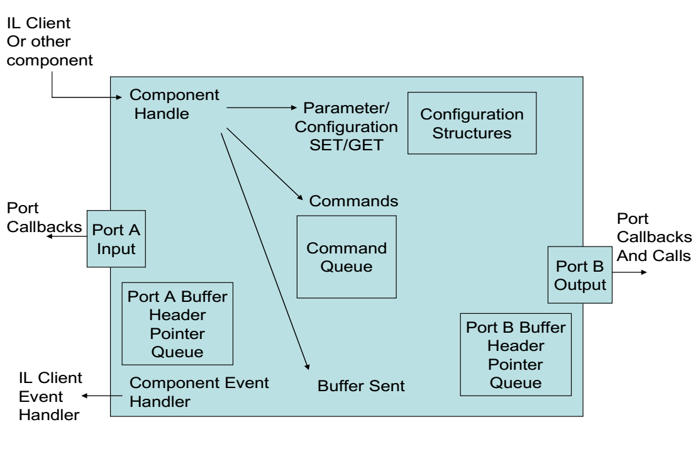
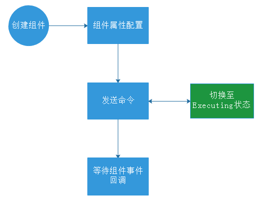

# OpenMAX概述

> OpenMax(Open Media Acceleration)开放多媒体加速器，也被称为OMX，是无授权费的、C语言编写的多媒体API标准，API提供了音频、视频、静态图片的一些常用处理操作的接口。目标是降低将多媒体软件移植到新的处理器和体系结构的成本和复杂性。

## 作用

- 加速跨OS和silicon平台的多媒体组件的开发、整合和编程，**提高APP和多媒体接口跨平台可移植性**[^1]。
- 使library和codec实现者能够**快速有效的利用新silicon的潜在的加速功能**[^2]，而不关心下层的硬件结构。

## 框架

根据官方文档OpenMAX主要分为AL、IL、DL三个层级

### AL

**多媒体应用**（Media Player Application）和**多媒体框架**（Platform Media Framework，例如Android上的StageFright或MediaCodec API、Windows上的DirectShow、FFmpeg或Libav、GStreamer）的标准接口，使得应用在多媒体接口上具有了可移植性。

### IL

提供**多媒体框架**和**多媒体组件**(如硬件或软件的音/视频编解码器)之间的标准化接口。

IL层使得应用程序与多媒体框架可以以一种统一的方式与多媒体编解码器对接，而编解码器本身可以是硬件与软件的任何组合形式，这样编解码器可以做到==**对用户透明**==，用户无需关注编解码器的实现细节问题。**如果没有IL，那么不同的编解码厂商都需要按照自己的方式实现一套接口，并且各个厂商之间也是不通用的，这样会使得跨平台移植变得极其复杂。**

### DL

提供**软件**(如视频编解码器和3D引擎)和**物理硬件**(如DSP、CPUs、GPUs)之间的标准化接口，全方位包含了OpenMAX音频、视频以及图像处理功能（函数集合），这些功能可以由芯片厂商针对新的处理器进行实现和优化，然后编解码厂商在此基础上实现一些广泛的编解码功能：

- 音频信号处理：比如FFT（快速傅立叶变换）、滤波器等；
- 图像处理：比如色域转换（RGB、YUV等）；
- 视频处理：比如实现并且优化的 MPEG-4, H.264, MP3, AAC 和 JPEG；

## 组件

组件是OpenMAX IL的单元，每一个组件实现一种功能。

### 组成

1. 配置结构体（Parameter/Configuration Set/Get）：用于用户代码直接与组件进行交互，包括组件属性设置获取、组件状态设置获取等。
2. Port口：负责记录与之建立隧道链接的组件的信息，数据交流必不可少。
3. Buffer管理：负责管理组件内部接收以及送出的数据流。
4. 组件事件句柄（Component Event Handler）：负责组件向用户代码进行事件通知，类似于Linux内核的Input子系统事件。
5. 命令序列：负责存储并处理来自于用户代码产生的命令，比如状态转换等。

## IL Client

IL层的客户端，组件的管理者，Client通过组件内部提供的相关回调函数来对组件进行管理，应用程序调用IL Client提供的接口来操作组件。

## Tunneled

**两个组件通过port进行相互链接**，然后组件内部自行协调进行数据交流。整个链接过程是由组件的管理者连续调用两个组件的链接函数完成的，**组件的链接函数里面会判断两个port是否适合链接**，如果适合的话就将对方port以及COMP的句柄信息记录下来，存放到一个port结构体描述当中，这样的话两个组件就可以通过port来进行通信以及数据传输了。

