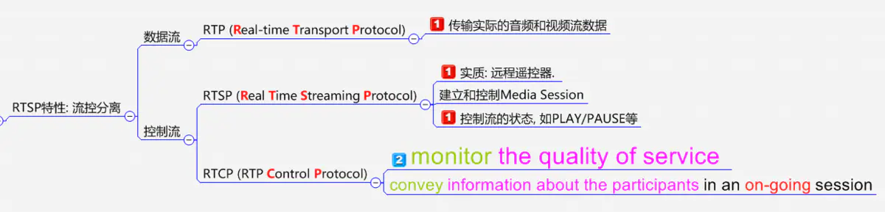
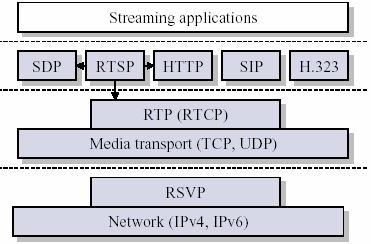
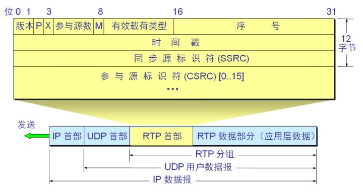
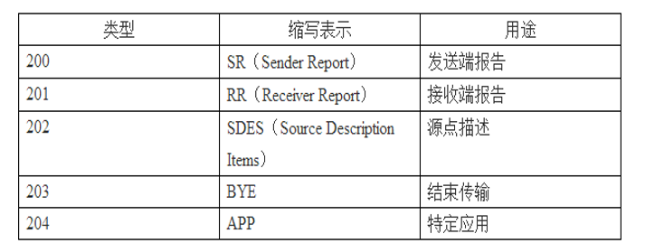
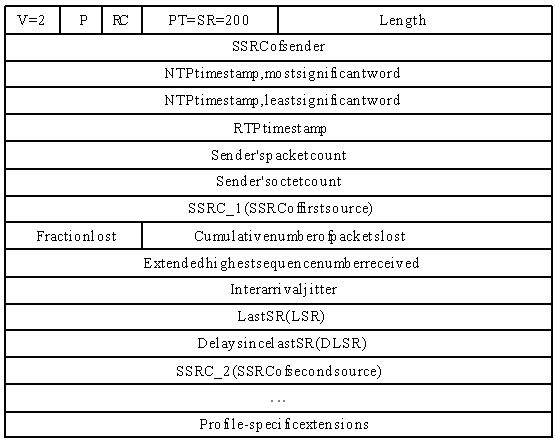
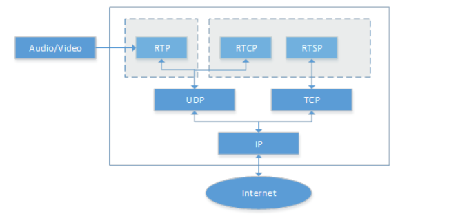

# RTSP&RTP&RTCP

## 简介

### RTSP（Real Time Streaming Protocol）

- TCP/IP协议体系中的应用层协议，负责有效传输
- RTSP位于RTP和RTCP之上，使用TCP或UDP完成数据传输
- RTSP的客户端和服务器端都可以发出请求

### RTP（Real-time Transport Protocol）

详细说明了在互联网上传递音频和视频的标准数据包格式

### RTCP（Real-time Transport Control Protocol）

RTP的姐妹协议，由于RTP只负责有序传输并不保证可靠传输，因此使用RTCP为正在提供的服务做质量反馈和同步

## RTP

> 负责对流媒体数据进行封包并实现媒体流的实时传输，该协议提供的信息包括：时间戳（用于同步）、序列号（用于丢包和重排序检测）、以及负载格式（用于说明数据的编码格式）。

### 实时传输

TCP作为可靠传输协议，有对应的检测和重传机制确保数据能够正确送达目的地址，但是一旦发生数据丢失，数据流的传说会被迫暂停和延迟，这在实时传输中是不能容忍的。因此RTP基于UDP传输协议，其本身不提供可靠的传输机制或是流量控制或拥塞控制，它依靠RTCP提供这些服务。当发生数据丢失时，由上层决定重传机制（控制信息），例如I帧、P帧、B帧数据，在网络状况不佳时，如果丢失P帧或是B帧，可以不进行重传，由预测算法完成丢帧的补全（即使画面出现卡顿也优先保证实时性）。

### RTP建立在UDP上

从上图可看出RTP被划分在传输层，它建立在UDP上。同UDP协议一样，**为了实现其实时传输功能，RTP也有固定的封装形式。RTP用来为端到端的实时传输提供时间信息和流同步，但并不保证服务质量。服务质量由RTCP来提供。**

### RTP是应用层的一部分

从应用开发者的角度看，RTP 应当是应用层的一部分。在应用的发送端，开发者必须编写用 RTP 封装分组的程序代码，然后把 RTP 分组交给 UDP 插口接口。在接收端，RTP 分组通过 UDP 插口接口进入应用层后，还要利用开发者编写的程序代码从 RTP 分组中把应用数据块提取出来。

### RTP的工作机制

当应用程序建立一个RTP会话时，应用程序将确定一对目的传输地址。目的传输地址由一个网络地址和一对端口组成`IP地址：端口号`，有两个端口：偶数端口给RTP包，奇数端口给RTCP包，使得RTP/RTCP数据能够正确发送。RTP数据发向偶数的UDP端口，而对应的控制信号RTCP数据发向相邻的奇数UDP端口（偶数的UDP端口＋1），这样就构成一个UDP端口对。 

- RTP分组只包含数据信息
- RTCP分组包含控制信息

### RTP首部

- `l V`：RTP协议的版本号，占2位，当前协议版本号为2

- `l P`：填充标志，占1位，如果P=1，则在该报文的尾部填充一个或多个额外的八位组，**它们不是有效载荷的一部分**

- `l X`：扩展标志，占1位，如果X=1，则在RTP报头后跟有一个扩展报头

- `l CC`：CSRC计数器，占4位，指示CSRC 标识符的个数，**多于15个也只记15个**

- `l M`: 标记，占1位，不同的有效载荷有不同的含义，对于视频，标记一帧的结束；对于音频，标记会话的开始

- `l PT`: 有效载荷类型，占7位，用于说明RTP报文中有效载荷的类型，如GSM音频、JPEM图像等

- `l 序列号`：占16位，用于标识发送者所发送的RTP报文的序列号，每发送一个报文，序列号增1。接收者通过序列号来检测报文丢失情况，重新排序报文，恢复数据

- `l 时戳(Timestamp)`：占32位，时戳反映了该RTP报文的第一个八位组的采样时刻。接收者使用时戳来计算延迟和延迟抖动，并进行同步控制

- `l 同步信源(SSRC)标识符`：占32位，用于标识同步信源。该标识符是随机选择的**（MD5随机算法）**，在同一个RTP会话中不能有相同的SSRC

- `l 参与源(CSRC)标识符`：0～15项，每项32比特，用来标志对一个RTP混合器产生的新包有贡献的所有RTP包的源。由混合器将这些有贡献的SSRC标识符插入表中。SSRC标识符都被列出来，以便接收端能正确指出交谈双方的身份

这里的同步信源是指产生媒体流的信源，它通过RTP报头中的一个32位数字SSRC标识符来标识，而不依赖于网络地址，接收者将根据SSRC标识符来区分不同的信源，进行RTP报文的分组。特约信源是指当混合器接收到一个或多个同步信源的RTP报文后，经过混合处理产生一个新的组合RTP报文，并把混合器作为组合RTP报文的SSRC，而将原来所有的SSRC都作为CSRC传送给接收者，使接收者知道组成组合报文的各个SSRC。

## RTCP

> RTCP负责服务质量的监视与反馈、媒体间的同步，以及多播组中成员的标识。在RTP会话期 间，各参与者周期性地传送RTCP包。RTCP包中含有已发送的数据包的数量、丢失的数据包的数量等统计资料，因此，各参与者可以利用这些信息动态地改变传输速率，甚至改变有效载荷类型。RTP和RTCP配合使用，它们能以有效的反馈和最小的开销使传输效率最佳化，因而特别适合传送网上的实时数据。

- QoS质量反馈
- 为每个RTP源传输一个固定的CNAME标识符
- 知晓成员数目，控制包的发送速率
- 传输最小连接控制信息

RTCP有如下五种分组类型：

## RSTP

> RTSP(Real-Time Stream Protocol)协议是一个基于文本的多媒体播放控制协议，属于应用层。RTSP以客户端方式工作，对流媒体提供播放、暂停、后退、前进等操作。该标准由IETF指定，对应的协议是RFC2326。RTSP作为一个应用层协议，提供了一个可供扩展的框架，使得流媒体的受控和点播变得可能，它主要用来控制具有实时特性的数据的发送，但其本身并不用于传送流媒体数据，而必须依赖下层传输协议(如RTP/RTCP)所提供的服务来完成流媒体数据的传送。RTSP负责定义具体的控制信息、操作方法、状态码，以及描述与RTP之间的交互操作。

