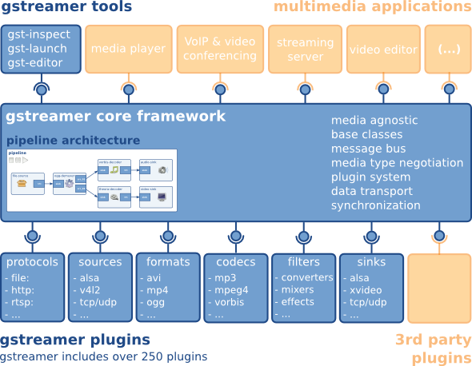
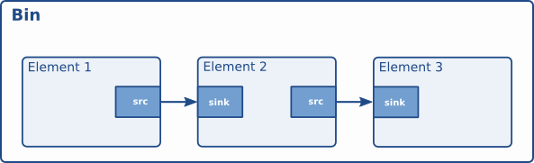

# GStreamer

## 架构



### Media Applications

应用层，包括gstreamer自带的工具（gst-inspect、gst-launch）以及基于gstreamer封装的库

### Core Framework

+ `上层应用所需的接口`
+ `Plugin的框架`
+ `Pipeline的框架`
+ `数据在各个Element间的传输及处理机制`
+ `多个媒体流间的同步（比如音视频同步）`
+ `其他各种所需的工具库`

### Plugins

- `Protocols`：负责各种协议的处理，file，http，rtsp等。
- `Sources`：负责数据源的处理，alsa，v4l2，tcp/udp等。
- `Formats`：负责媒体容器的处理，avi，mp4，ogg等。
- `Codecs`：负责媒体的编解码，mp3，vorbis等。
- `Filters`：负责媒体流的处理，converters，mixers，effects等。
- `Sinks`：负责媒体流输出到指定设备或目的地，alsa，xvideo，tcp/udp等。
- 第三方插件

---

## GStreamer组件

### Element

- 所有可用组件的基础
* 一个Element实现一个功能
* 使用link point与外界交互（pad作为输入/输出端口）
* 一个Element可以有多个相同的pad


#### 创建一个GstElement

1. 借助工厂对象`GstElementFactory`，工厂对象根据name属性区分，首先找到要创建的element所属的工厂对象，在创建GstElement对象。

   ```c
   GstElementFatory *factory;
   factory = gst_element_factory_find("factory_name")；
   GstElement *element;
   element = gst_element_factory_create(factory, "element_name");
   ```

2. 直接使用`gst_element_factory_make(factory_name, element_name)`[^1]创建。

3. 当不在使用GstElement时，需要使用`gst_element_unref(GstElement *element)`[^2]来释放element对象占用的内存资源。`gst_element_unref()`会将元件的引用计数``refcount``减少1，`refcount`初始值为1，当`refcount`减少到0时元件被销毁。

```C
gst_element_set_name();		//设置element对象的name
gst_element_get_name();		//获取element对象的name
```

### 箱柜bin

- 容器：容纳其他元件对象，实际自身也是GstElement对象
- 同时管理多个Element：对bin的状态修改会同步到bin中所有的Element上，降低了应用的复杂度
- 顶层bin必须是一个pipeline



#### 创建一个bin

1. 借助工厂方法

   ```C
   GstElement *thread, *pipeline;
   // 创建线程对象，同时为其指定唯一的名称。
   thread = gst_element_factory_make ("thread", NULL);
   // 根据给出的名称，创建一个特定的管道对象。
   pipeline = gst_pipeline_new ("pipeline_name");
   ```

2. 直接使用`gst_bin_new("bin_name")`创建

#### 常用操作

- 使用`gst_bin_add(GST_BIN(bin), element)`将**已存在的**元件添加到bin中

- 使用`gst_bin_get_by_name("GST_BIN(bin), "element_name")`根据Element的name获取bin中的Element，由于bin可以嵌套bin，因此该函数会递归查找

- 使用`gst_bin_remove (GST_BIN (bin), element)`移除bin中的Element

#### 元件的状态

- `GST_STATE_NULL`：这是默认状态。在这种状态下没有分配资源，因此，转换到此状态将释放所有资源。当元件的引用计数达到0并被释放时，该元件必须处于此状态。
- `GST_STATE_READY`：在就绪状态下，元件已分配了其所有全局资源，即可以保留在流中的资源。你可以考虑打开设备，分配缓冲区等。但是在这种状态下不会打开流，因此流位置自动为零。如果先前已打开流，则应在此状态下将其关闭，并应重置位置，属性等。
- `GST_STATE_PAUSED`：在此状态下，元件已打开流，但未对其进行处理。此时元件可以修改流的位置，读取和处理数据，状态一旦更改为PLAYING，即可开始播放。总之，PAUSED与PLAYING相同，只是PAUSED没有运行时钟。
- `GST_STATE_PLAYING`：在该`PLAYING`状态下，与该`PAUSED`状态下完全相同，只是时钟现在运行。

- 使用`gst_element_set_state(element, GST_STATE_PLAYING)`修改元件状态

### 衬垫Pad

> 衬垫是元件与外界的链接通道，它必须依附于某个元件，有src和sink两个端口

1. 获取元件的衬垫pad：`gst_element_get_pad(element, "src")`
2. `gst_element_get_pad_list(element)`获取元件所有的衬垫
3. `gst_pad_get_parent(GstPad *)`可以获得指定衬垫所属的元件

```c
gst_pad_get_name(GstPad *);
gst_pad_set_name(GstPad *);
```

#### Pad link

```c
GstPad *srcpad, *sinkpad;
srcpad = gst_element_get_pad(element1, "src");
sinkpad = gst_element_get_pad(element2, "sink");
//连接
gst_pad_link(srcpad, sinkpad);
//断开
gst_pad_unlink(srcpad. sinkpad);
```

#### Pad Capability

> 描述元件的功能

```c
GstCaps *caps;
caps = gst_pad_get_caps (pad);
g_print ("pad name is: %s\n", gst_pad_get_name (pad));
while (caps) {
  g_print (" Capability name is %s, MIME type is %s\n",
  gst_caps_get_name (caps),
  gst_caps_get_mime (caps));
  caps = caps->next;
}
```

#### Pad Capability for Filtering

通过`gst_caps_new_simole()`限制两个Element之间的数据流格式

```c
static gboolean
//
link_elements_with_filter (GstElement *element1, GstElement *element2)
{
  gboolean link_ok;
  GstCaps *caps;

  caps = gst_caps_new_simple ("video/x-raw",
          "format", G_TYPE_STRING, "I420",
          "width", G_TYPE_INT, 384,
          "height", G_TYPE_INT, 288,
          "framerate", GST_TYPE_FRACTION, 25, 1,
          NULL);

  link_ok = gst_element_link_filtered (element1, element2, caps);
  gst_caps_unref (caps);

  if (!link_ok) {
    g_warning ("Failed to link element1 and element2!");
  }

  return link_ok;
}
```

#### Ghost Pad

> bin没有属于自己的src pad和sink pad，因此引入ghost pad，将其与第一个Element的sink pad和最后一个Element的src pad相连接，对bin的操作实际想让与对Element的pad操作

#### 动态衬垫 Dynamic pads

> 创建元件时某些元件不一定会立即生成所有的pad


oggdemux元件创建时只有一个sink pad，它会根据接收到的ogg流信息为ogg流动态创建src pad，并在接受完之后动态删除创建的src pad

### Bus

> Bus是gstreamer内部用于将消息从内部不同的streaming线程，传递到bus线程，再由bus所在线程将消息发送到应用程序。应用程序只需要向bus注册消息处理函数，即可接收到pipline中各element所发出的消息，使用bus后，应用程序就不用关心消息是从哪一个线程发出的，避免了处理多个线程同时发出消息的复杂性。


### Gstreamer数据消息交互


[^1]:`gst_element_factory_make()`实际是方法1中两个函数的组合
[^2]:

