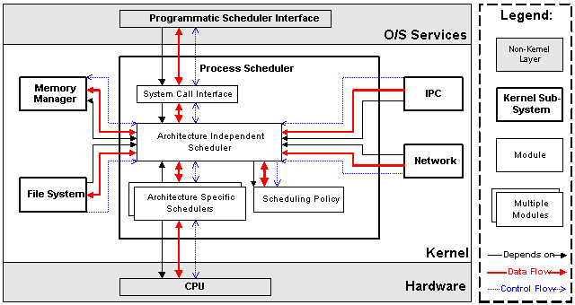
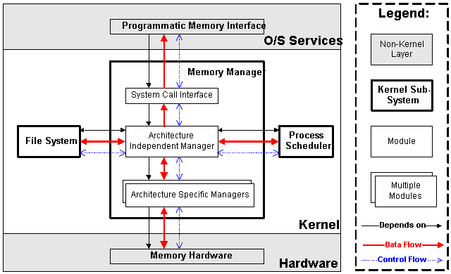

# Linux内核整体框架

## 整体框架

### Process Scheduler

进程调度，提供对CPU的访问控制，主要包括以下四个模块：



- `Scheduling Poliicy`：进程调度策略，决定能够拥有CPU资源的进程
- `Architecture-specific Schedulers`：体系结构相关部分，用于对不同的CPU的控制，实际与CPU相连的部分
- `Architecture-independent Scheduler`：体系结构无关部分，与Scheduling Policy共同决定要执行的进程，然后传给Architecture-specific Scheduler来resume制定进程
- `System Call Interface`：系统调用接口，为用户空间的操作提供接口

### Memory Manage

提供对内存资源的访问控制。Linux内核提供虚拟内存机制，以进程为单位，将进程使用的虚拟内存映射到实际的硬件物理内存上，以扩大进程能够调用的内存资源。



- `Architecture Specific Managers`：体系结构相关部分。提供用于访问硬件Memory的虚拟接口。

-  `Architecture Independent Manager`：体系结构无关部分。提供所有的内存管理机制，包括：以进程为单位的memory mapping；虚拟内存的Swapping。

- ` System Call Interface`：系统调用接口。通过该接口，向用户空间程序应用程序提供内存的分配、释放，文件的map等功能。

### Virtual File System

VFS将不同功能的外部设备抽象成文件，通过统一的文件操作接口（Device Driver）来访问。


- `Device Drivers`：设备驱动，用于控制所有的外部设备及控制器。

- `Device Independent Interface`：该模块定义了描述硬件设备的统一方式（统一设备模型），所有的设备驱动都遵守这个定义，可以降低开发的难度。同时可以用一致的形式向上提供接口。

- `Logical Systems`：每一种文件系统，都会对应一个Logical System（逻辑文件系统），它会实现具体的文件系统逻辑。

- `System Independent Interface`：该模块负责以统一的接口（块设备和字符设备）表示硬件设备和逻辑文件系统，这样上层软件就不再关心具体的硬件形态了。

- `System Call Interface`：系统调用接口，向用户空间提供访问文件系统和硬件设备的统一的接口。

### NET

负责管理系统的网络设备，并实现多种多样的网络标准。网卡作为外部设备，按照Linux“一切皆文件”的设计思想，NET也应该设计成文件接口，事实上NET子系统的设计也与VFS类似，但是由于网络协议的设计和多样性，系统为了隐去设备的实现细节方便用户操作将其单独划分成一个部分（因此Linux也不完全是“文件”）。


- `Network Device Drivers`：网络设备的驱动，和VFS子系统中的设备驱动是一样的。

- `Device Independent Interface`：和VFS子系统中的是一样的。

- `Network Protocols`：实现各种网络传输协议，例如IP, TCP, UDP等等。

- `Protocol Independent Interface`：屏蔽不同的硬件设备和网络协议，以相同的格式提供接口（socket)。

- `System Call interface`：系统调用接口，向用户空间提供访问网络设备的统一的接口。

### Inter-Process Communication

进程间通信

### Linux内核目录含义

```c
include/        ---- 内核头文件，需要提供给外部模块（例如用户空间代码）使用。
 
kernel/         ---- Linux内核的核心代码，包含了3.2小节所描述的进程调度子系统，以及和进程调度相关的模块。
 
mm/             ---- 内存管理子系统（3.3小节）。
 
fs/             ---- VFS子系统（3.4小节）。
 
net/            ---- 不包括网络设备驱动的网络子系统（3.5小节）。
 
ipc/            ---- IPC（进程间通信）子系统。
 
arch/          ---- 体系结构相关的代码，例如arm, x86等等。 
arch/mach      ---- 具体的machine/board相关的代码。 
arch/include/asm ---- 体系结构相关的头文件。 
arch/boot/dts  ---- 设备树（Device Tree）文件。
 
init/           ---- Linux系统启动初始化相关的代码。 
block/          ---- 提供块设备的层次。 
sound/          ---- 音频相关的驱动及子系统，可以看作“音频子系统”。 
drivers/        ---- 设备驱动（在Linux kernel 3.10中，设备驱动占了49.4的代码量）。
 
lib/            ---- 实现需要在内核中使用的库函数，例如CRC、FIFO、list、MD5等。 
crypto/         ----- 加密、解密相关的库函数。 
security/       ---- 提供安全特性（SELinux）。 
virt/           ---- 提供虚拟机技术（KVM等）的支持。 
usr/            ---- 用于生成initramfs的代码。 
firmware/       ---- 保存用于驱动第三方设备的固件。
 
samples/        ---- 一些示例代码。 
tools/          ---- 一些常用工具，如性能剖析、自测试等。
 
Kconfig, Kbuild, Makefile, scripts/ ---- 用于内核编译的配置文件、脚本等。
 
COPYING         ---- 版权声明。 
MAINTAINERS     ----维护者名单。 
CREDITS         ---- Linux主要的贡献者名单。 
REPORTING-BUGS  ---- Bug上报的指南。
 
Documentation, README ---- 帮助、说明文档。
```

## 设备驱动模型


### Bus

>  A bus is a channel between the processor and one or more devices. For the purposes of the device model, all devices are connected via a bus, even if it is an internal, virtual, "platform" bus. Buses can plug into each other. A USB controller is usually a PCI device, for example. The device model represents the actual connections between buses and the devices they control. A bus is represented by the bus_type structure. It contains the name, the default attributes, the bus' methods, PM operations, and the driver core's private data.

- 总线是CPU和一个或多个设备之间信息交互的通道

- 总线可以互相嵌套

### Class

> A class is a higher-level view of a device that abstracts out low-level implementation details. Drivers may see a SCSI disk or an ATA disk, but, at the class level, they are all simply disks. Classes allow user space to work with devices based on what they do, rather than how thet are connected or how they work.

class与面向对象程序设计中的class相似，集合具有相似功能或属性的设备，抽象出一套在多个设备之间共用的属性和接口函数，对用户空间隐去实现细节，减少重复劳动。

### Device

> At the lowest level, every device in a Linux system is represented by an instance of struct device. The device structure contains the information that the device model core needs to model the system. Most subsystems, however, track additional information about the devices they host. As a result, it is rare for devices to be represented by bare device structures; instead, that structure, like kobject structures, is usually embedded within a higher-level representation of the device.

抽象设备的各种属性以便于计算机识别设备

### Device Driver

>**The device driver-model tracks all of the drivers known to the system.**
>
>The main reason for this tracking is to enable the driver core to match up drivers with new devices. Once drivers are known objects within the system, however, a number of other things become possible. Device drivers can export information and configuration variables that are independent of any specific device.

抽象硬件设备的驱动程序为用户空间提供对设备的相关操作

### Device & Device Driver

- Device描述设备“有什么用”
- Driver描述“怎么去用设备”

- 设备驱动模型一直遍历系统中所有的驱动，当没有Device注册时，对应的Device Driver不执行初始化操作，一旦有新的Device注册，那么就是根据名字进行match，如果名字相同就执行Device Driver中的初始化函数（probe），初始化设备使其为可用状态。