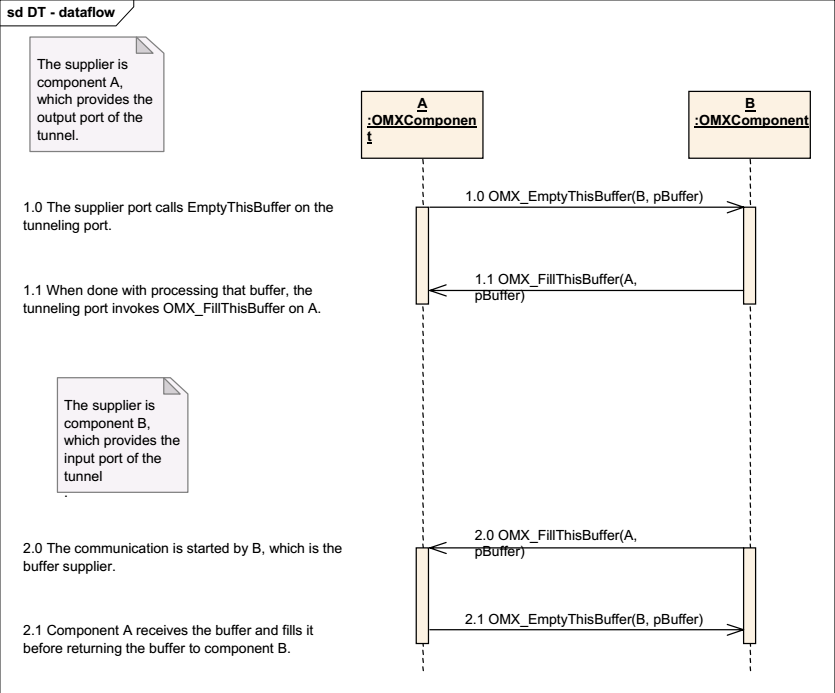
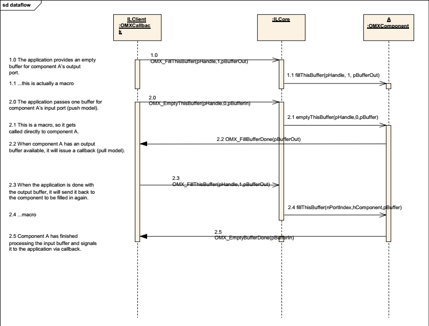

# OpenMAX——组件

## Component Handler

组件描述符，类似于文件描述符，可以认为是组件的抽象化实例。

## Configuration Structures

## Commend Queue

## Port

## Port Buffer Manage

## Component Event Handler

## buffer发送模块

### tunnel模式

### Non-tunnel模式

