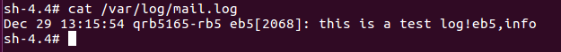
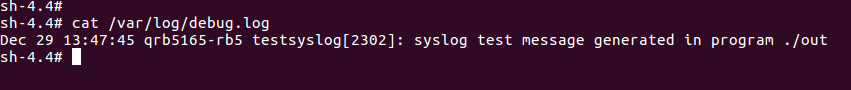
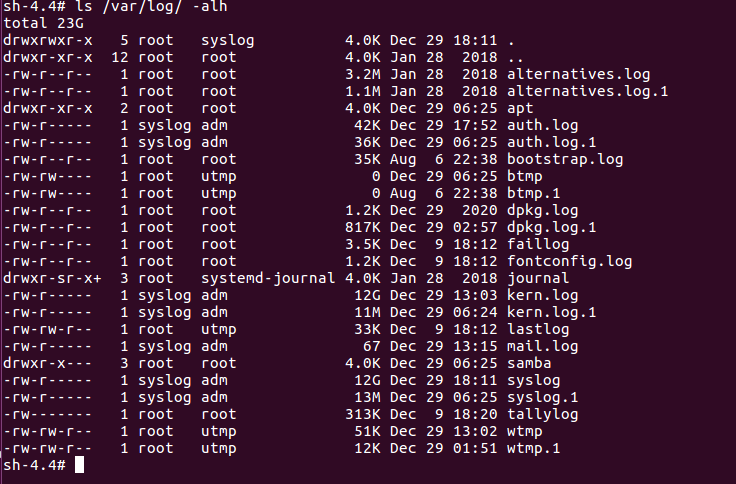
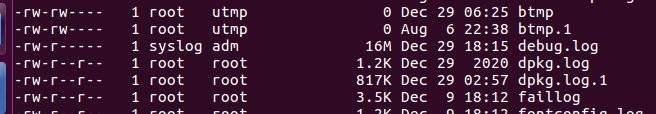
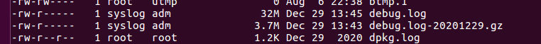

# syslog user guide


## syslog介绍

`syslogd`是Linux系统默认的日志守护进程，和内核一起提供了系统的日志信息。

### syslog格式

> <06>Dec 29 13:03:00 qrb5165-rb5 kernel: [   43.724758] android_work: sent uevent 

- `<06>`：PRI部分，包含Facility和Priority，为系统定义
- `Dec 29 13:03:00 qrb5165-rb5`：HEADER部分，为时间和主机名（或IP）
- `kernel: [43.724758] android_work: sent uevent`：MSG部分，包含TAG和Content

### Facility

`Facility`可以理解为日志的来源或设备或选择条件，系统定义的`Facility`如下：

```c
Numerical             Facility
 Code
  0             kernel messages
  1             user-level messages
  2             mail system
  3             system daemons
  4             security/authorization messages (note 1)
  5             messages generated internally by syslogd
  6             line printer subsystem
  7             network news subsystem
  8             UUCP subsystem
  9             clock daemon (note 2)
 10             security/authorization messages (note 1)
 11             FTP daemon
 12             NTP subsystem
 13             log audit (note 1)
 14             log alert (note 1)
 15             clock daemon (note 2)
 16             local use 0  (local0)
 17             local use 1  (local1)
 18             local use 2  (local2)
 19             local use 3  (local3)
 20             local use 4  (local4)
 21             local use 5  (local5)
 22             local use 6  (local6)
 23             local use 7  (local7)
Note 1 - Various operating systems have been found to utilize
  Facilities 4, 10, 13 and 14 for security/authorization,
  audit, and alert messages which seem to be similar.
Note 2 - Various operating systems have been found to utilize
  both Facilities 9 and 15 for clock (cron/at) messages.
```

### Priority

`Priority`为日志的优先级，如下所示：

```c
Numerical         Priority
Code
 0       Emergency: system is unusable
 1       Alert: action must be taken immediately
 2       Critical: critical conditions
 3       Error: error conditions
 4       Warning: warning conditions
 5       Notice: normal but significant condition
 6       Informational: informational messages
 7       Debug: debug-level messages
```

## syslog函数

**Linux C**的`syslog.h`中提供一套系统日记写入接口，包括三个函数：`openlog`，`syslog`和`closelog`。
调用`openlog`是可选择的。如果不调用`openlog`，则在第一次调用`syslog`时，自动调用`openlog`。调用closelog也是可选择的，它只是关闭被用于与`syslog`守护进程通信的描述符。

### openlog

```c
void openlog(char *ident, int option, int facility)
```

- `ident`：标志字符串，用户自定义log标识
- `option`：用户控制选项，用于与用户空间交互
  - LOG_CONS：日志信息在写给日志服务器的同时打印到终端
  - LOG_NDELAY：即时记录日志
  - LOG_PERROR：把日志信息也输出到标准错误流
  - LOG_PID：在标志字段中记录进程的PID值
- `facility`：日志类型，含义与`Chapter 1.2`相同，在`syslog.h`头文件中定义如下：

```c
#define LOG_KERN        (0<<3)  
#define LOG_USER        (1<<3)  
#define LOG_MAIL        (2<<3)  
#define LOG_DAEMON      (3<<3)  
#define LOG_AUTH        (4<<3)  
#define LOG_SYSLOG      (5<<3)  
#define LOG_LPR         (6<<3)  
#define LOG_NEWS        (7<<3)  
#define LOG_UUCP        (8<<3)  
#define LOG_CRON        (9<<3)  
#define LOG_AUTHPRIV    (10<<3)
#define LOG_FTP         (11<<3)
```

### syslog

```c
void syslog(int priority, const char *format, ...);
```

- `priority`：一般为`facility`和`priority`的或操作，如：`LOG_USER | LOG_DEBUG`、`LOG_KERN | LOG_INFO`等等。

```c
#define LOG_EMERG   0   /* system is unusable */  
#define LOG_ALERT   1   /* action must be taken immediately */  
#define LOG_CRIT    2   /* critical conditions */  
#define LOG_ERR     3   /* error conditions */  
#define LOG_WARNING 4   /* warning conditions */  
#define LOG_NOTICE  5   /* normal but significant condition */  
#define LOG_INFO    6   /* informational */  
#define LOG_DEBUG   7   /* debug-level messages */ 
```

### sample code

```c
// test.c
#include<stdio.h>
#include<syslog.h>

int main(int argc, char*argv[])
{
	openlog("eb5", LOG_PID, LOG_MAIL);
	syslog(LOG_INFO | LOG_MAIL, "this is the test!eb5,info");	/*这里LOG_INFO和LOG_MAIL不分先后 */
	closelog();
	return 0;
}
```

```shell
# 编译
gcc -o out test.c

# 运行
./out
```

系统会往`/var/log/mail.log`（如果没有就自动创建）中写入我们指定的信息：



## syslog配置

### /etc/rsyslog.conf

`/etc/rsyslog.conf`是系统关于`syslog` 的全局配置文件，主要关注最后一句：

```shell
$IncludeConfig /etc/rsyslog.d/*.conf
```

指出了系统引用`/etc/rsyslog.d`目录下的`.conf`类型文件作为`syslog`的配置文件，用户可以在该目录下添加自定义的配置文件。

### /etc/rsyslog.d/50-default.conf

`/etc/rsyslog.d/50-default.conf`是系统默认的`syslog`配置文件，其中设置了大部分log信息的存储位置，用户可以在其中添加自己的配置语句。`syslog.conf`的语法规则如下：

> facility.priority action

- `facility`：指定log来源
- `priority`：指定log等级
- `action`：指定对log的动作，具体如下：

```c
/*
1.系统上的绝对路径		 将log存储到普通文件
2. | (管道符号)			通过管道传递给其他命令
3.终端				 打印到终端，如：/dev/console
4.@host				  远程主机，如：@10.0.0.1
5.用户				 系统用户，如：root
6.*					  登录到系统上的所有用户
*/
```

- 可以用正则表达式`*`代表所有的选项，例如`mail.*`表示记录所有级别的mail相关的日志
- 可以用`!`表示取反

#### Sample

在`/etc/rsyslog.d/50-default.conf`中添加一行：

```shell
user.debug	-/var/log/debug.log
```

重启`rsyslogd`：

```shell
/etc/init.d/rsyslog restart
```

这时用户程序运行的log都会输出到`/var/log/debug.log`中。

```c
#include <syslog.h>

int main(int argc, char *argv[])
{
	openlog("testsyslog", LOG_CONS | LOG_PID, 0);
	syslog(LOG_USER | LOG_DEBUG, "syslog test message generated in program %s \n", argv[0]); 
	closelog();
    return 0;
}
```

```shell
# 编译
gcc -o out test.c

# 运行
./out
```



### /etc/logrotate.conf

 `logrotate`程序是一个日志文件管理工具。用来把旧的日志文件更名或删除，并创建新的日志文件，我们把它叫做“转储”。是个使日志轮替的程序，使用它可以避免日志体积一天天的变大，而可以根据你自己的需求来设定日志转储。`logrotate`配置文件路径：`/etc/logrotate.conf`。

` /etc/logrotate.d/`下面放置自定义的一些配置文件，常用参数如下：

| 参数                             | 功能                               |
| -------------------------------- | ---------------------------------- |
| compress/nocompress              | 通过gzip压缩转储后的日志           |
| create mode owner group/nocreate | 使用指定的文件模式创建新的日志文件 |
| delaycompress/nodelaycompress    | 是否等待下一次转储时才压缩日志     |
| ifempty/notifempty               | 是否转储空日志                     |
| preratate ... endscript          | 转储前执行命令                     |
| postrotate ... endscript         | 转储后执行命令                     |
| rotate [count]                   | 日志文件删除前的转储次数           |
| size [size]                      | 转储文件大小                       |
| daily                            | 每日转储                           |
| weekly                           | 每周转储                           |
| monthly                          | 每月转储                           |
| maxage [num]                     | 转储周期                           |

#### Sample

在`/etc/logrotate.d/`目录下添加如下`debug`可以修改`debug.log`的转储设置。

```shell
# /etc/logrotate.d/debug
/var/log/debug.log{
		su root syslog # 设置日志文件用户组
        daily   # 每天转储
        rotate 30  # 保留30个备份
        size 20M	# 日志文件超过20M开始轮转
        compress   # 压缩转储的备份文件
        delaycompress  # 转储的日志文件到下一次转储时才压缩，以防syslog继续写入
        nocreate      # 不创建新的日志文件
        missingok		# 允许丢失
        notifempty  # 日志为空不转储
        dateext    # 为日志文件打上日期标签
        postrotate
        	/etc/init.d/rsyslog restart		# 重启syslogd
        endscript
}
```

配置完转储之后可以用如下代码测试设置是否生效：

```c++
#include <fstream>
#include <string>
#include <iostream>
#include <syslog.h>

using namespace std;

int main()
{
    ifstream in(/var/log/kern.log.1);
    string line;
    
    openlog("testsyslog", LOG_CONS | LOG_PID, 0);
    if(in) {
        while(getline(in, line))
        {
        	syslog(LOG_USER | LOG_DEBUG, const_cast<char *>(line.c_str())); 
        }
    } else {
        cout <<"no such file" << endl;
    }
    closelog();
    return 0;
}
```

由于系统设置`logrotate`每天运行一次，因此需要手动调用来查看轮转结果：

```shell
/usr/sbin/logrotate /etc/logrotate.d/debug
```



当`debug.log`没达到20M时，日志不会转储：



当`debug.log`超过20M之后，日志开始转储：


下一次轮转将上一次轮转文件压缩：



### /etc/crontab

crond 是linux下用来周期性的执行某种任务或等待处理某些事件的一个守护进程，系统在`/etc/cron.daily`目录下配置了一个`logrotate`文件用于控制每天轮转日志，为了更加便利用户控制日志轮转周期，可以修改`/etc/corntab`用于自定义周期轮转指定日志。

`/etc/crontab`是系统任务调度的配置文件，参数格式如图：

```shell
# For details see man 4 crontabs

# Example of job definition:
# .---------------- minute (0 - 59)
# |  .------------- hour (0 - 23)
# |  |  .---------- day of month (1 - 31)
# |  |  |   .------- month (1 - 12) OR jan,feb,mar,apr ...
# |  |  |   |  .---- day of week (0 - 6) (Sunday=0 or 7) OR sun,mon,tue,wed,thu,fri,sat
# |  |  |   |  |
# m  h  dom mon dow  user 		command
# *  *  *   *   *    user-name command to be executed
```

在以上各个字段中，还可以使用以下特殊字符：

- 星号（*）：代表所有可能的值，例如month字段如果是星号，则表示在满足其它字段的制约条件后每月都执行该命令操作。

- 逗号（,）：可以用逗号隔开的值指定一个列表范围，例如：`1,2,5,7,8,9`

- 中杠（-）：可以用整数之间的中杠表示一个整数范围，例如：`2-6`表示`2,3,4,5,6`

- 正斜线（/）：可以用正斜线指定时间的间隔频率，例如在`hour`字段设置`0-23/2`表示每两小时执行一次。同时正斜线可以和星号一起使用，例如`*/10`，如果用在`minute`字段，表示每十分钟执行一次。

#### Sample

设置每十分钟，轮转一次`/var/log/debug.log`:

```shell
# /etc/crontab
# 添加
*/10 * * * * root /usr/sbin/logrotate /etc/logrotate.d/debug
```

