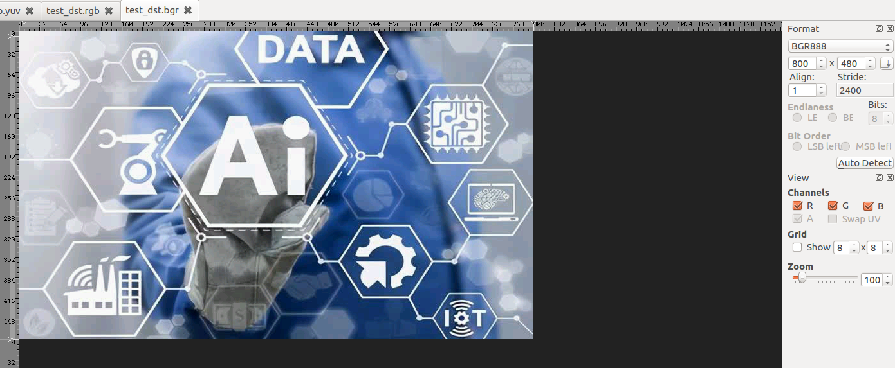

# FastCV APIs: NV12 to BGR888(Compile on host machine)

## 1. Setting up the host Linux machine

### 1.1 Hexagon SDK

- Download the Hexagon SDK version 3.4.2 for Linux from [Hexagon DSP SDK](https://developer.qualcomm.com/software/hexagon-dsp-sdk)
- Unzip the file and install the SDK:

```shell
$ cd qualcomm_hexagon_sdk_3_4_2_linux/
$ chmod +x qualcomm_hexagon_sdk_3_4_2_eval.bin
$ ./qualcomm_hexagon_sdk_3_4_2_eval.bin
```

- Set the environment variable `$HEXAGON_SDK_ROOT` by the command.

```shell
$ source $Hexagon_SDK_ROOT/3.4.2/setup_sdk_env.source
```

### 1.2 linaro64

- Download the `gcc-linaro-4.9-2014.11-x86_64_aarch64-linux-gnu.tar.xz` from [linaro release](http://releases.linaro.org/archive/14.11/components/toolchain/binaries/aarch64-linux-gnu/)
- Extract the tar file and copy folder `gcc-linaro-4.9-2014.11-x86_64_aarch64-linux-gnu` to `$Hexagon_SDK_ROOT/tools/` folder.
- Rename `gcc-linaro-4.9-2014.11-x86_64_aarch64-linux-gnu` folder to `linaro64`

### 1.3 FastCV SDK

- Download the FastCV SDK v1.7.1 for Linux Embeded - Linux Installer from [FastCV tools & Resources](https://developer.qualcomm.com/software/fast-cv-sdk/tools)
- Install the SDK:

```shell
$ chmod a+x fastcv-installer-linuxembedded-1-7-1.bin
$ ./fastcv-installer-linuxembedded-1-7-1.bin
```

### 1.4 FastCV Sample Preparation

- Copy the fastcv library to `fastcvSimpleTest/lib`
- Copy the fastcvSimpleTest folder form FastCV SDK to `$Hexagon_SDK_ROOT/examples/common`

```shell
$ cp $FastCV_SDK_ROOT/lib/64-bit/libfastcv.a $FastCV_SDK_ROOT/samples/fastcvSimpleTest/ lib/
$ cp -r $FastCV_SDK_ROOT/samples/fastcvSimpleTest/ $Hexagon_SDK_ROOT/3.4.2/examples/common
```

## 2. Color Conversion APIs

FastCV provides a lots of [color conversion APIs](https://developer.qualcomm.com/docs/fastcv/api/group__color__conversion.html) to help user implement color conversion work of different format image, here we give a sample that convert the YUV420 NV12 image to BGR888 format.

FastCV can't convert YUV420 NV12 to BGR888 straightly, to implement this we should convert the YUV420 NV12 to RGB565 then to BGR888, it means that we need to convert the image format twice.

- Notice that FastCV accept NV12 format YUV420 image.
- `fcvColorYUV420toRGB565u8()` and `fcvColorRGB565ToBGR888u8()` are used here.

```c++
void fcvColorYUV420toRGB565u8(const uint8_t *__restrict src,
                              unsigned int srcWidth,
                              unsigned int srcHeight,
                              uint32_t *__restrict dst 
)
```

Color conversion from YUV (YCbCr) 4:2:0 PesudoPlanar (Interleaved CbCr) to RGB 565.

- `src`: 8-bit image of input YUV 4:2:0 values.
- `dst`: 16-bit image of output RGB 565 values. R in LSBs. 2 pixels are packed into one 32-bit output
- `srcWidth`: Image width, should be multiple of 4.
- `srcHeight`: Image height.

```c++
void fcvColorRGB565ToBGR888u8(const uint8_t *__restrict src,
                              uint32_t srcWidth,
                              uint32_t srcHeight,
                              uint32_t srcStride,
                              uint8_t *__restrict dst,
                              uint32_t dstStride 
)		
```

This function performs RGB conversion from 16-bit interleaved RGB565 to 24-bit interleaved BGR888 it can be used to convert 16-bit interleaved BGR565 to 24-bit interleaved RGB888 as well.

- `src`: is the pointer to the RGB565 image.
- `srcWidth`: Width of the input image, should be a multiple of 8.
- `srcHeight`: Height of the input image
- `srcStride`: Stride of input RGB565 image (i.e., number of bytes between column 0 of row 0 and column 0 of row 1). If left at 0, srcStride is default to srcWidth * 2.
- `dstStride`: Stride of output BGR888 image (i.e., number of bytes between column 0 of row 0 and column 0 of row 1). If left at 0, dstStride is default to srcWidth * 3, should be a multiple of 8.
- `dst`: Output BGR888

## 3. FastCV Sample

At the beginning of the sample code there are some macro definition, include image size and image path, you should modify these according to your image information before compile.

Compile fastcvSimpleTest:

```shell
$ cd $Hexagon_SDK_ROOT/examples/common/fastcvSimpleTest
$ make tree V=UbuntuARM_Debug_aarch64
```

Push files to the target:

```shell
$ adb shell mkdir /data/fastcvSample
$ adb push test_nv12.yuv /data/fastcvSample
$ adb push $HEXAGON_SDK_ROOT/examples/common/fastcvSimpleTest/UbuntuARM_Debug_aarch64/ship/fastcvSimpleTest /data/fastcvSample
$ adb shell chmod 777 /data/fastcvSample/fastcvSimpleTest
$ adb shell /data/fastcvSample/fastcvSimpleTest
```

Then you can use adb pull to extract the output files to the host machine:

```shell
$ adb pull /data/fastcvSample/test_dst.bgr ./
```

Open the bgr file with 7yuv:



You need select the image format and configuration the size of image in the tool bur at right side to get a right display.

## 4. Tips

- To get a YUV420 NV12 image you can use ffmpeg tool to implement conversion:

```shell
$ ffmpeg -i test.jpg -s 800x480 -pix_fmt nv12 ./test_nv12.yuv
```

- To understand the file read/write, you should learn more details of YUV420 format and BGR format.
- Use fastCV on target device, please reference[fastCV C++ lib usage](https://github.com/gesanqiu/fastCV-sample).
