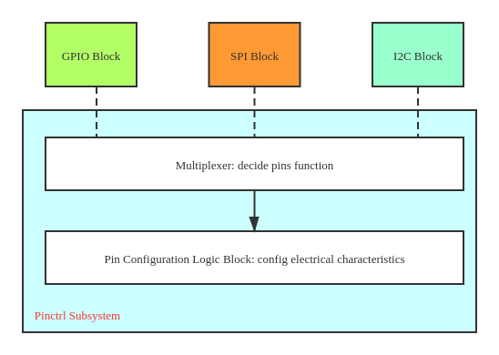
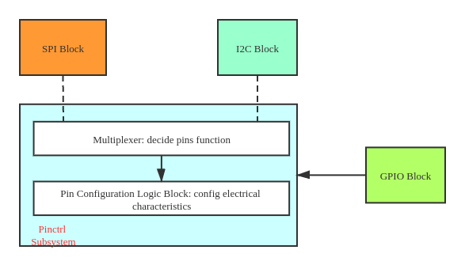

# Pinctrl Subsystem 与 GPIO Subsystem的交互

## Pinctrl子系统

开发人员可以针对一款SOC设计多块target board，每块target board可以有不同的用途，但一款SOC提供的引脚资源是有限的，因此引脚的复用对于拓展SOC功能有重要意义，基于此Pinctrl子系统被设计出来，其主要目的在于：

- 管理系统中所有可以控制的引脚
- 引脚的复用
  - 单个引脚的function
  - 多个引脚组成pin group实现特定的功能
- 对应设备所需引脚的电器特性

## GPIO子系统

GPIO作为嵌入式领域最基础的部分，我想大部分嵌入式工程师的入门都是从配置GPIO引脚，改变GPIO电平开始的。gpio子系统帮助我们管理整个系统gpio的使用情况，同时内核通过`./drivers/gpio/gpiolib.c`对外提供了一系列操控GPIO资源的接口。

## 两者的交互

从逻辑上来说，GPIO是Pin的一种function，因此GPIO Subsystem应该是Pinctrl Subsystem的client，基于pinctrl subsystem提供的功能，处理GPIO有关的逻辑，作为软件工程师我们期待的硬件设计应该如下图：

GPIO的HW block应该和其他功能复用的block是对等关系的，它们共同输入到一个复用器block，这个block的寄存器控制哪一个功能电路目前是active的。pin configuration是全局的，不论哪种功能是active的，都可以针对pin进行电气特性的设定。这样的架构下，上图中上边的三个block是完全独立的HW block，其控制寄存器在SOC datasheet中应该是分成三个章节描述，同时，这些block的寄存器应该分别处于不同的地址区间。

但是在实际的设计中，我们知道Pinctrl Driver给GPIO Driver提供了一系列接口，因此SOC设计框架图如下：

即Pinctrl和GPIO两个子系统之间有一定的耦合，反映在硬件上就是两者的寄存器占据了一个memory range。

这么设计的原因我目前还没有清晰的理解，可能需要我接着看GPIO Subsystem的源码才能弄清楚，但是有两个思路：

- 历史原因：在早期SOC Pin脚不多的时候GPIO子系统就已经存在了，后来由于版本迭代加入了Pinctrl子系统，并且由于受到其复用设计的影响，最终决定把GPIO作为Pinctrl的一个bake-end加进来；
- 第二就是蜗窝科技在其文章[^1]中提到这样一个例子：

> 
> 假设某一个gpio chip只包括2个gpio，这两个gpio分别和uart进行功能复用。
>
> 如果这两个管脚是同时控制的，要么是gpio，要么是uart，就很好处理了，按照pinctrl subsystem的精神，抽象出两个function：gpio和uart，gpio chip在使用gpio功能的时候，调用pinctrl set state，将它们切换为gpio即可。
>
> 但是，如果这两个gpio可以分开控制（很多硬件都是这样的设计的），麻烦就出现了，每个gpio要单独抽象为一个function，因此我们可以抽象出3个function：gpio1、gpio2和uart。
>
> 然后考虑一下一个包含32个gpio的chip（一般硬件的gpio bank都是32个），如果它们都可以单独控制，则会出现32个function。而系统又不止有一个chip，灾难就发生了，我们的device tree文件将会被一坨坨的gpio functions撑爆！

可能和文章发表日期有关，这个例子我觉得有些晦涩，因为据同事的说法只有早期需要自己手动对每个function进行配置的时候才会发生这种情况，目前我基于高通的平台做开发时，Pinctrl的配置已经变得非常简单，高通有自己的总线设计（Qualcomm Universal Peripheral v3 Serial Engine， QUP v3 SE），对SOC的Pin事先做了详细的configure和function的抽象，开发人员只需要按照datasheet配置即可。

以下是我对这个例子的一些理解：

- function需要自己根据datasheet去做关于pin脚读取寄存器的配置，假设我们把一个function理解成一个配置文件。
- 基于第一种框架设计，GPIO Block和SPI、I2C、UART等功能复用处于同一层次。

两个pin脚作为gpio复用可以同时控制的情况很好理解，**要么是gpio，要么是uart**，上层只需要带着指定的复用function配置文件交给Multiplexer即可同时完成对这两个引脚的功能选择。

当gpio chip下的gpio可以分开控制的时候，由于每个gpio都可以实现不同的IO功能，它们function的属性有所区别，各个gpio的function配置没法写在一起，因此每个gpio都得抽象出一个各自的function配置文件，因此在配置引脚的时候就会出现GPIO function撑爆设备树的情况。

此外由于对每个gpio都单独做了配置，在不同平台之间做移植的时候，需要修改大量的配置信息。

例子解释完，再来说说pinctrl和gpio的耦合设计是如何解决这个问题的（由于我目前还没找到高通平台关于function配置的代码，所以以下都是未经论证的个人猜想，未来有了新的理解会继续更新）：

由于采用了耦合设计，pinctrl直接向gpio提供接口进行资源的控制，这样就跳过了Multiplexer选择复用功能的过程，而是在gpio申请pin脚的时候直接由pinctrl将该pin脚指定为gpio功能。当gpio driver需要使用某个管脚的时候，直接调用`pinctrl_request_gpio`，向pinctrl subsystem申请，pinctrl subsystem会维护一个gpio number到pin number的map，将gpio subsystem传来的gpio number转换为pin number之后，调用`struct pinmux_ops`中有关的回调函数即可。

**即由于采用耦合设计——它们寄存器处于一个memory range，使得gpio这个function的配置可以由pinctrl直接实现，对上层就表现为不需要再额外详细配置gpio这个function，gpio driver只需要提供gpio number即可。**

[^1]: [linux内核中的GPIO系统之（5）：gpio subsysem和pinctrl subsystem之间的耦合](http://www.wowotech.net/gpio_subsystem/pinctrl-and-gpio.html)

